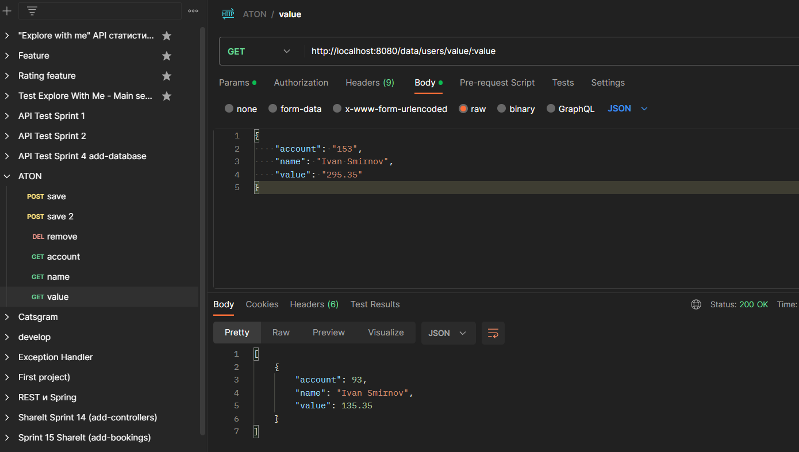

Был создан сервис и протестирован с помощью Postman

Для хранения данных был выбран MultiValuedMap - это словарь, 
который может хранить несколько значений с одинаковым ключом.
Так как это map удаление и добавление элементов осуществлялась через константу.
Алгоритмическая сложность поиска по полю в лучшем случае осуществляется 
за O(const), а в худшем за O(n)